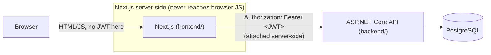

# Implementation Guide

This explains **how the system was built and how it works internally** — the request flow, the
patterns used, and why — so a new developer can get oriented without reading every file first. For
*what* the project does and how to run it, see the root `README.md`. For deployment, see
`DEPLOYMENT.md`. For Swagger specifically, see `backend/AssignmentSystem.Api/SWAGGER.md`.

## Architecture at a glance



The frontend is a **backend-for-frontend (BFF)**, not a thin client calling the API directly from the
browser. Every real data operation is: `Browser → Next.js route handler (attaches JWT) → ASP.NET Core
API (verifies JWT + role + ownership) → PostgreSQL`. The two apps are independently deployable and
only agree on one thing: the JSON shape of the DTOs (kept in sync manually between
`backend/AssignmentSystem.Api/Dtos/*.cs` and `frontend/lib/types.ts`).

---

## Backend (`backend/AssignmentSystem.Api/`)

### Project layout

```
Controllers/    one per resource — thin, no business logic, just HTTP <-> Service glue
Services/       I<X>Service interface + <X>Service implementation — all business logic lives here
Entities/       EF Core entity classes (the actual database model)
Dtos/           request/response shapes exposed over HTTP (never the entities themselves)
Mapping/        MappingExtensions.cs — Entity -> Dto conversion (.ToDto())
Validators/     FluentValidation rules, one class per request DTO
Data/           AppDbContext (EF Core config) + DbSeeder (demo data, + bulk seed hook in Development)
Exceptions/     NotFoundException, ForbiddenException, AppValidationException, UnauthorizedAppException
Middleware/     ExceptionHandlingMiddleware — turns thrown exceptions into HTTP responses
Extensions/     ClaimsPrincipalExtensions — reads the caller's user id/role off the JWT claims
Migrations/     EF Core-generated schema history
Program.cs      composition root: wires up every piece above
```

There's no separate "repository" layer — `AppDbContext` (EF Core) already *is* the repository/unit of
work, so services inject it directly.

### Request lifecycle

Every endpoint follows the same shape. Example — grading a submission
(`Controllers/SubmissionsController.cs` → `Services/SubmissionService.cs`):

```csharp
// Controller: HTTP concerns only — route, role gate, pull the DTO out of the body,
// read who's calling from the JWT claims, hand off to the service, wrap the result.
[HttpPatch("{id:guid}/grade")]
[Authorize(Roles = "Teacher,Admin")]
public async Task<ActionResult<SubmissionDto>> Grade(Guid id, [FromBody] GradeSubmissionRequest request)
{
    var result = await _submissionService.GradeSubmissionAsync(id, request, User.GetUserId(), User.GetUserRole());
    return Ok(result);
}
```

```csharp
// Service: all the actual logic — load the entity, check ownership, validate the
// business rule, mutate, save, map to DTO.
public async Task<SubmissionDto> GradeSubmissionAsync(Guid id, GradeSubmissionRequest request, Guid userId, UserRole role)
{
    var submission = await _context.Submissions.Include(s => s.Assignment)... .FirstOrDefaultAsync(s => s.Id == id);
    if (submission is null) throw new NotFoundException(...);
    if (role != UserRole.Admin && submission.Assignment.CreatedByTeacherId != userId)
        throw new ForbiddenException(...);                              // ownership check
    if (request.Marks < 0 || request.Marks > submission.Assignment.MaxMarks)
        throw new AppValidationException(...);                          // business rule
    submission.Marks = request.Marks; submission.Status = SubmissionStatus.Graded; ...
    await _context.SaveChangesAsync();
    return submission.ToDto();                                          // Entity -> Dto
}
```

`[Authorize(Roles = "...")]` only handles the coarse "is this role allowed to hit this endpoint at
all" check. Anything finer-grained — "is this *specific* teacher allowed to touch *this* assignment"
— is deliberately done inside the service, not via an ASP.NET policy, because it depends on data
(who owns the row), not just the caller's role.

### Data model (EF Core Code-First)

`Entities/*.cs` are plain C# classes; `Data/AppDbContext.cs` configures them with Fluent API
(`OnModelCreating`) — unique indexes (`User.Email`, `(Submission.AssignmentId, Submission.StudentId)`,
...), foreign keys, cascade behavior, decimal precision. Nothing about Postgres specifically leaks
into the entities — Npgsql is only chosen in `Program.cs`'s `options.UseNpgsql(...)`.

Schema changes flow as: edit an entity/`AppDbContext` → `dotnet ef migrations add <Name>` → a new file
appears under `Migrations/` → `db.Database.Migrate()` (called automatically on startup in
`Program.cs`) applies it. `backend/Database/schema.sql` is a plain-SQL export of the same migrations
for anyone without the .NET SDK.

Right after `Database.Migrate()` + `DbSeeder.SeedAsync()`, `Program.cs` — only when
`app.Environment.IsDevelopment()` — also calls `DbSeeder.SeedBulkDemoDataAsync()`, which reads and
executes `backend/Database/seed-large.sql` as a raw SQL batch (`Database.ExecuteSqlRawAsync`). That
script is plain PL/pgSQL (`generate_series`, `pgcrypto`'s `crypt()`), not EF Core — it exists to give a
freshly cloned repo a realistic-scale dataset (1000 students etc.) to develop/test against locally,
without shipping synthetic data to a real deployment. It self-guards on `"Classes"` already containing
`'Class 1 - A'`, so re-running it after the first successful seed is a no-op.

### Auth

- `Services/TokenService.cs` issues the JWT on login: claims are `sub` (user id), `email`,
  `ClaimTypes.Role` (role, as a string), `name` (full name).
- `Services/AuthService.cs` verifies the password with `BCrypt.Net.BCrypt.Verify` and calls
  `TokenService`.
- `Program.cs` registers JWT Bearer auth (`AddJwtBearer`) with the signing key/issuer/audience from
  config, so every request's `Authorization: Bearer <token>` header is verified automatically before a
  controller action even runs.
- `Extensions/ClaimsPrincipalExtensions.cs` (`User.GetUserId()` / `User.GetUserRole()`) reads those
  claims back out inside a controller — this is how a service knows "who is calling" without any
  extra lookup.
- `[Authorize]` / `[Authorize(Roles = "...")]` attributes on controllers/actions are the coarse role
  gate; ownership checks (as in the grading example above) are the fine-grained gate, done in services.

### Validation

Every request DTO with a body has a matching `Validators/*.cs` class (FluentValidation). These run
automatically (`AddFluentValidationAutoValidation()` in `Program.cs`) before the controller action even
executes — a failing validator short-circuits straight to a 400 with field-level errors, the action
method never runs.

### Error handling

Services throw one of four typed exceptions (`Exceptions/*.cs`) instead of returning error codes.
`Middleware/ExceptionHandlingMiddleware.cs` catches them at the very top of the pipeline and maps each
to an HTTP status + a consistent JSON envelope `{ message, errors, traceId }`:

| Exception | HTTP status |
|---|---|
| `NotFoundException` | 404 |
| `ForbiddenException` | 403 |
| `UnauthorizedAppException` | 401 |
| `AppValidationException` | 400 |
| anything else | 500 (logged via Serilog, message hidden from the client) |

### Business rules — where to find them

All seven rules described in the root README live in `Services/AssignmentService.cs` and
`Services/SubmissionService.cs`, not scattered across controllers. The most involved one — deadline /
late-submission / teacher-reopen logic — is a single private method,
`SubmissionService.DetermineSubmissionStatus`, called from both the create and update paths so the
rule only exists once.

### Testing (`backend/AssignmentSystem.Api.Tests/`)

- `Infrastructure/SqliteContextFactory.cs` — spins up a fresh EF Core Sqlite **in-memory** database per
  test (not the pure `UseInMemoryDatabase` provider — Sqlite actually enforces foreign keys/unique
  indexes, so a test on "one submission per student per assignment" is a real constraint check).
- `Services/*.cs` — call service methods directly against that database, assert on the returned DTO or
  the thrown exception type. This is where most of the 7 business rules are covered.
- `Infrastructure/ApiFactory.cs` (`WebApplicationFactory<Program>`) + `Authorization/*.cs` — boot the
  *real* ASP.NET Core pipeline (auth, `[Authorize]`, the exception middleware) against an isolated
  Sqlite database and hit it over real HTTP, to prove role gates return the right 401/403/200 — not
  just that the service method would.

---

## Frontend (`frontend/`)

### Project layout

```
app/
  login/page.tsx              login form
  admin/, teacher/, student/   one route group per role, each with its own layout.tsx (nav shell)
  api/auth/{login,logout,me}   BFF auth endpoints (see below)
  api/backend/[...path]        catch-all proxy to the ASP.NET API
middleware.ts                  role-based route guard (UX only, see below)
components/                    shared UI (StatusBadge, NavShell, ConfirmDialog, components/ui/* primitives)
lib/
  types.ts                     TypeScript interfaces mirroring the backend DTOs, kept in sync by hand
  auth.ts                      dependency-free JWT payload decode (used by middleware + /api/auth/me)
  api-client.ts                low-level fetch wrappers (apiGet/apiPost/apiPatch/... -> /api/backend/*)
  api.ts                       one typed function per backend endpoint, built on api-client.ts
  schemas.ts                   zod validation schemas for every form
```

### Auth: the BFF pattern, step by step

The JWT the backend issues **never reaches browser JavaScript**. Concretely:

1. **Login** (`app/api/auth/login/route.ts`, runs server-side) — receives `{email, password}` from the
   browser, calls the real backend's `POST /api/auth/login` itself, and on success sets the JWT as an
   **httpOnly** cookie (`lib/auth.ts`'s `AUTH_COOKIE_NAME`). The response sent back to the browser
   contains only `{ user }` — no token.
2. **Every other API call** goes through `app/api/backend/[...path]/route.ts`, a single catch-all proxy
   that: reads the JWT out of the httpOnly cookie (server-side, browser JS still can't see it), attaches
   `Authorization: Bearer <token>`, forwards the request (JSON or multipart — it streams the raw body
   through unmodified either way) to the real backend, and streams the response back.
3. **`middleware.ts`** runs on every request to `/admin/*`, `/teacher/*`, `/student/*`, `/login`. It
   decodes (not verifies — no secret key on the frontend) the role claim from the cookie and redirects:
   no token → `/login`; wrong role for the path prefix → that role's home page. This is explicitly
   **UX-only** — the real security boundary is the backend re-validating the JWT's signature and
   `[Authorize(Roles=...)]` on every request, independent of anything decided here (see the comment
   block at the top of `middleware.ts`).
4. **`components/auth-provider.tsx`** fetches `/api/auth/me` once on mount (which itself just decodes
   the cookie server-side) to know who's logged in, purely for displaying a name/role in the nav — again
   not a security decision.

Why bother with all this instead of just storing the JWT in `localStorage` and calling the API
directly from the browser? A token in `localStorage`/a non-httpOnly cookie is readable by any script
running on the page — one XSS bug anywhere in the app (or a compromised npm dependency) can exfiltrate
every user's session. An httpOnly cookie can't be read by JavaScript at all, so that entire class of
attack is closed off. The cost is one extra network hop (browser → Next.js → API instead of browser →
API directly), which is negligible.

### Data fetching pattern

Three layers, thin at every level:

```
lib/api-client.ts   generic fetch wrappers: apiGet/apiPost/apiPut/apiPatch/apiDelete/apiPostForm
                     (all hit /api/backend/*, throw ApiClientError on non-2xx)
lib/api.ts           one typed function per endpoint, e.g. gradeSubmission(id, data) -> apiPatch(...)
app/**/page.tsx      client components call functions from lib/api.ts, hold the result in useState
```

Pages are simple client components (`"use client"`) that `useEffect` a `load()` call from `lib/api.ts`
on mount, keep the result in `useState`, and re-fetch after a successful mutation. There's no
React Query/SWR/global cache — deliberately kept simple given the app's size (see
`frontend/eslint.config.mjs` for the one downgraded lint rule this implies).

### Forms & validation

Every form pairs `react-hook-form` with a `zod` schema from `lib/schemas.ts` via
`@hookform/resolvers/zod`, mirroring the backend's FluentValidation rules where they're known
client-side (e.g. `submissionSchema` mirrors the "answer text or a file, and file ≤ 5MB" rule the
backend's `SubmissionsController` also enforces). Client-side validation is a UX nicety only — the
backend re-validates everything regardless, since it's the actual trust boundary.

---

## End-to-end walkthrough: a student submits an assignment

Tracing one real user action through the whole stack, both directions:

1. Student fills the answer textarea + optional file on
   `app/student/assignments/[id]/page.tsx`, submits. `react-hook-form`'s `handleSubmit` validates
   against `submissionSchema` first (if the form fails validation, it never sends anything).
2. The page builds a `FormData` and calls `submitAssignment(assignmentId, formData)` from `lib/api.ts`,
   which calls `apiPostForm` from `lib/api-client.ts`, which `fetch`es
   `POST /api/backend/assignments/{id}/submissions` (same-origin, no JWT visible in this call).
3. `app/api/backend/[...path]/route.ts` reads the JWT from the httpOnly cookie, forwards the exact same
   multipart request to the real backend at `POST {BACKEND_URL}/api/assignments/{id}/submissions` with
   `Authorization: Bearer <token>` attached.
4. ASP.NET Core's JWT Bearer middleware verifies the token's signature/expiry and populates
   `HttpContext.User`; `[Authorize(Roles = "Student")]` on `SubmissionsController` lets it through.
5. `SubmissionsController.Submit(...)` reads `User.GetUserId()` and calls
   `SubmissionService.SubmitAsync(...)`.
6. The service: loads the assignment, checks the student's `ClassId` matches the assignment's subject's
   class (rule 3), checks the assignment is `Published` (rule 2), checks for an existing submission
   (rule 7 — upsert instead of duplicate), calls `DetermineSubmissionStatus` (rule 4 — deadline/late/
   reopen), saves the optional file to `wwwroot/uploads` if present, `SaveChangesAsync()`s, returns
   `submission.ToDto()`.
7. The response streams back through the proxy route to the browser as JSON; the page updates its
   `useState` with the returned `SubmissionDto` and shows "Submission saved."

Grading (`app/teacher/.../submissions/[submissionId]/page.tsx` → `gradeSubmission` →
`PATCH .../grade` → `SubmissionService.GradeSubmissionAsync`, rules 5 and 6) and every other mutation
in the app follow this exact same shape.

---

## Quick reference — "I need to..."

| Task | Look at |
|---|---|
| Add a field to an entity | `Entities/<X>.cs`, `Data/AppDbContext.cs` (if it needs an index/constraint), then `dotnet ef migrations add ...` |
| Add a new business rule | The relevant `Services/<X>Service.cs` method — throw `AppValidationException`/`ForbiddenException` as appropriate |
| Add a new backend endpoint | New method on the matching `Controllers/<X>Controller.cs` + `Services/I<X>Service.cs`/`<X>Service.cs`, DTO in `Dtos/`, validator in `Validators/` if it has a body |
| Change what an endpoint returns | `Mapping/MappingExtensions.cs`'s `.ToDto()` for that entity, and the matching DTO class |
| Add a new frontend page | New `app/<role>/.../page.tsx`; add a typed function in `lib/api.ts` if it's a new endpoint |
| Change a form's validation | `lib/schemas.ts` |
| Change how a role's routes are guarded | `middleware.ts` (UX only — remember the backend `[Authorize]` is the real gate) |
| Add a business-rule test | `AssignmentSystem.Api.Tests/Services/<X>ServiceTests.cs` |
| Add an authorization test | `AssignmentSystem.Api.Tests/Authorization/RoleAuthorizationTests.cs` |
