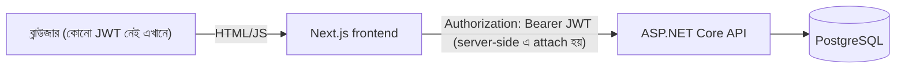

# PROJECT GUIDE — সম্পূর্ণ প্রজেক্ট ব্যাখ্যা (বাংলায়)

> এই ফাইলটা বানানো হয়েছে যেন **যেকোনো নতুন ডেভেলপার** — যিনি এই প্রজেক্টের কোড আগে কখনো দেখেননি — একবার পড়েই পুরো
> সিস্টেমটা বুঝে ফেলতে পারেন: কী বানানো হয়েছে, কোন কোন টেকনোলজি ব্যবহার হয়েছে, কোড কীভাবে অর্গানাইজ করা আছে,
> রিকোয়েস্ট একটা ক্লিক থেকে ডাটাবেজ পর্যন্ত কীভাবে যায়, লোকালে কীভাবে রান করাবেন, এবং ফ্রি-তে কীভাবে হোস্ট করবেন।
>
> এই ফাইলটা রুট ডিরেক্টরির `README.md`, `DEPLOYMENT.md`, আর `IMPLEMENTATION_GUIDE.md` — এই তিনটা ফাইলের সব তথ্য
> একসাথে মিলিয়ে বাংলায় লেখা হয়েছে। ইংরেজিতে আরও ডিটেইল বা রেফারেন্স লাগলে ওই তিনটা ফাইলও রাখা আছে, মুছে ফেলা হয়নি।

---

## ১. প্রজেক্টটা আসলে কী

এটা একটা **স্কুল/কলেজের জন্য Assignment ও Submission ম্যানেজমেন্ট সিস্টেম** — নাম **SynosLMS**। তিনটা রোল আছে:

- **Admin** — সব ইউজার (Admin/Teacher/Student), ক্লাস, সাবজেক্ট, এবং কোন টিচার কোন সাবজেক্ট পড়াবে সেই assignment তৈরি
  করেন। কোনো self-registration নেই — সব অ্যাকাউন্ট Admin-ই বানান।
- **Teacher** — নিজেকে assign করা সাবজেক্টের জন্য Assignment বানান (Draft বা Published), স্টুডেন্টদের Submission
  দেখেন, Marks + Feedback দিয়ে গ্রেড করেন, দরকার হলে Submission আবার খুলে দেন (`ReturnedForRevision`)।
- **Student** — নিজের ক্লাসের Published Assignment দেখেন, টেক্সট আনসার + (ঐচ্ছিক) ফাইল সাবমিট করেন, ডেডলাইনের আগে
  বা টিচার allow করলে পরেও আপডেট করতে পারেন, গ্রেড হলে Marks ও Feedback দেখেন।

মূল সিকিউরিটি বৈশিষ্ট্য: JWT-ভিত্তিক Authentication, প্রতিটা ব্যাকএন্ড এন্ডপয়েন্টে role-based Authorization, এবং
৪ ঘণ্টার business-rule টেস্ট কভারেজ (২৯টা automated test)।

---

## ২. টেকনোলজি স্ট্যাক

| লেয়ার | কী ব্যবহার হয়েছে |
|---|---|
| **Frontend** | Next.js 16 (App Router), React 19, TypeScript 5, Tailwind CSS 4, react-hook-form + zod |
| **Backend** | ASP.NET Core 8 Web API (C#), EF Core (Npgsql provider), FluentValidation, Serilog, Swashbuckle (Swagger) |
| **Database** | PostgreSQL 14+ |
| **Auth** | Backend থেকে ইস্যু করা JWT, ফ্রন্টএন্ডে httpOnly cookie সেশন, role-based `[Authorize]` |
| **Testing** | xUnit, FluentAssertions, EF Core Sqlite in-memory provider, `WebApplicationFactory` |
| **Hosting (ফ্রি)** | Neon (Postgres) + Render (backend, Docker) + Vercel (frontend) |

> লক্ষ্য করুন — ফোল্ডারের নাম "asp" হলেও এটা Node.js ব্যাকএন্ড **না**, এটা **ASP.NET Core** ব্যাকএন্ড (তাই নাম "asp")।
> Backend আর Frontend দুটো সম্পূর্ণ আলাদা, স্বাধীনভাবে ডিপ্লয়যোগ্য অ্যাপ — এরা শুধু একটা জিনিসে একমত: JSON DTO-র
> shape (এটা backend-এর `Dtos/*.cs` আর frontend-এর `lib/types.ts` — দুই জায়গায় হাতে সিঙ্ক রাখা হয়)।

---

## ৩. প্রজেক্ট স্ট্রাকচার (ফোল্ডার ট্রি)

```
asp/
├── backend/
│   ├── AssignmentSystem.sln
│   ├── AssignmentSystem.Api/            ← ASP.NET Core Web API (মূল ব্যাকএন্ড)
│   │   ├── Controllers/                 → HTTP রুট, শুধু গ্লু কোড
│   │   ├── Services/                    → সব বিজনেস লজিক এখানে
│   │   ├── Entities/                    → EF Core ডাটাবেজ মডেল (User, Class, Subject, Assignment, Submission...)
│   │   ├── Dtos/                        → API-তে যা রেসপন্স/রিকোয়েস্টে যায়, entity নয়
│   │   ├── Mapping/                     → Entity → Dto কনভার্সন (.ToDto())
│   │   ├── Validators/                  → FluentValidation রুল, প্রতি DTO-র জন্য একটা
│   │   ├── Data/                        → AppDbContext (EF কনফিগ) + DbSeeder (ডেমো ডেটা)
│   │   ├── Exceptions/                  → কাস্টম exception ক্লাস (NotFound, Forbidden, ...)
│   │   ├── Middleware/                  → ExceptionHandlingMiddleware
│   │   ├── Extensions/                  → JWT claim থেকে userId/role বের করার হেল্পার
│   │   ├── Migrations/                  → EF Core মাইগ্রেশন হিস্ট্রি
│   │   ├── wwwroot/uploads/             → স্টুডেন্টের আপলোড করা ফাইল (লোকাল ডিস্কে)
│   │   ├── Program.cs                   → এন্ট্রি পয়েন্ট / সব কিছু ওয়্যার-আপ হয় এখানে
│   │   └── Dockerfile                   → Render-এ ডিপ্লয়ের জন্য
│   ├── AssignmentSystem.Api.Tests/      → xUnit টেস্ট (Services/, Authorization/, Infrastructure/)
│   └── Database/
│       ├── schema.sql                   → migration-এর প্লেইন SQL এক্সপোর্ট (SDK না থাকলে ব্যবহার করুন)
│       ├── seed.sql                     → ডেমো ডেটার SQL এক্সপোর্ট
│       └── seed-large.sql               → বাল্ক ডেমো ডেটাসেট (১০০০ স্টুডেন্ট ইত্যাদি) — Development-এ অটো-রান হয়, নিচে দেখুন
├── frontend/                            ← Next.js App (App Router)
│   ├── app/
│   │   ├── login/page.tsx
│   │   ├── admin/, teacher/, student/   → প্রতি রোলের নিজস্ব রুট গ্রুপ ও layout.tsx
│   │   └── api/
│   │       ├── auth/{login,logout,me}/  → BFF auth রুট
│   │       └── backend/[...path]/       → ব্যাকএন্ডে প্রক্সি করার catch-all রুট
│   ├── components/                      → শেয়ার্ড UI (nav-shell, status-badge, ui/* প্রিমিটিভ)
│   ├── lib/
│   │   ├── types.ts                     → ব্যাকএন্ড DTO-র সাথে মেলানো TypeScript টাইপ
│   │   ├── auth.ts                      → JWT ডিকোড হেল্পার
│   │   ├── api-client.ts                → জেনেরিক fetch র‍্যাপার
│   │   ├── api.ts                       → প্রতি এন্ডপয়েন্টের জন্য typed ফাংশন
│   │   ├── schemas.ts                   → zod ফর্ম ভ্যালিডেশন স্কিমা
│   │   └── config.ts                    → BACKEND_URL env var
│   ├── middleware.ts                    → role-based রুট গার্ড (UX-only)
│   └── Dockerfile                       → multi-stage build (Next.js standalone output) — Vercel এটা ব্যবহার করে না
├── .env.example                         → ব্যাকএন্ড env var রেফারেন্স
├── render.yaml                          → Render Blueprint (backend ডিপ্লয়মেন্ট কনফিগ)
├── README.md / DEPLOYMENT.md / IMPLEMENTATION_GUIDE.md   ← ইংরেজিতে বিস্তারিত ডকুমেন্টেশন (আগে থেকেই আছে)
└── PROJECT_GUIDE.md                     ← এই ফাইল
```

---

## ৪. আর্কিটেকচার — রিকোয়েস্ট কীভাবে যায়



এখানে সবচেয়ে গুরুত্বপূর্ণ ডিজাইন প্যাটার্ন হলো **BFF (Backend-for-Frontend)**। ফ্রন্টএন্ড কোনো "thin client" না
যে ব্রাউজার সরাসরি API কল করে — বরং প্রতিটা রিকোয়েস্ট যায়:

```
ব্রাউজার → Next.js এর নিজের route handler (এখানে JWT attach হয়, সার্ভার-সাইডে) → ASP.NET Core API
   (JWT সিগনেচার + role + ownership ভেরিফাই করে) → PostgreSQL
```

**কেন এমন করা হলো?** JWT যদি `localStorage`-এ বা সাধারণ (non-httpOnly) cookie-তে রাখা হয়, তাহলে পেজে থাকা যেকোনো
JavaScript (একটা XSS bug, বা একটা compromised npm package) সেটা পড়ে ফেলতে পারে — এবং তখন যেকোনো ইউজারের সেশন চুরি
হয়ে যেতে পারে। httpOnly cookie ব্রাউজারের JavaScript কখনোই পড়তে পারে না, তাই এই পুরো ধরনের অ্যাটাক বন্ধ হয়ে যায়।
এর বিনিময়ে একটা এক্সট্রা নেটওয়ার্ক হপ লাগে (browser → Next.js → API, সরাসরি browser → API না), যেটা নগণ্য।

ধাপে ধাপে:

1. **Login** (`app/api/auth/login/route.ts`, সার্ভার-সাইডে চলে) — ব্রাউজার থেকে `{email, password}` নেয়, নিজে
   ব্যাকএন্ডের `POST /api/auth/login` কল করে, JWT পেলে সেটাকে **httpOnly cookie**-তে সেট করে। ব্রাউজারে যা ফেরত
   যায় তাতে শুধু `{ user }` থাকে — টোকেন থাকে না।
2. **বাকি সব API কল** যায় `app/api/backend/[...path]/route.ts` — একটা catch-all প্রক্সি রুট দিয়ে, যেটা: httpOnly
   cookie থেকে JWT পড়ে (সার্ভার-সাইডে, ব্রাউজার JS তখনও দেখতে পায় না), `Authorization: Bearer <token>` হেডার
   বসায়, আসল ব্যাকএন্ডে রিকোয়েস্ট (JSON বা multipart, দুটোই) ফরওয়ার্ড করে, রেসপন্স ফেরত পাঠায়।
3. **`middleware.ts`** প্রতি রিকোয়েস্টে চলে (`/admin/*`, `/teacher/*`, `/student/*`, `/login`) — cookie থেকে role
   claim **ডিকোড** করে (**ভেরিফাই না** — ফ্রন্টএন্ডে সিক্রেট কী নেই) এবং রিডাইরেক্ট করে। এটা সম্পূর্ণ **UX-only** —
   আসল সিকিউরিটি বাউন্ডারি হলো ব্যাকএন্ড, যেটা প্রতিটা রিকোয়েস্টে JWT সিগনেচার আবার যাচাই করে।
4. **`components/auth-provider.tsx`** একবার `/api/auth/me` কল করে কে লগইন করে আছে জানার জন্য — শুধু ন্যাভবারে
   নাম/রোল দেখানোর জন্য, এটাও কোনো সিকিউরিটি ডিসিশন না।

---

## ৫. ব্যাকএন্ড — গভীরে (ASP.NET Core)

### কোড অর্গানাইজেশন প্যাটার্ন

`Controllers/` → `Services/` → `AppDbContext` (EF Core) — এটাই মূলত repository/unit-of-work হিসেবে কাজ করে, তাই
আলাদা কোনো "Repository" লেয়ার নেই। **Controller-এ কোনো বিজনেস লজিক থাকে না** — শুধু HTTP রুট, role gate, DTO বের
করা, এবং Service-কে কল করা।

একটা রিয়েল উদাহরণ দেখা যাক — একটা Submission গ্রেড করা (`Controllers/SubmissionsController.cs` →
`Services/SubmissionService.cs`):

```csharp
// Controller — শুধু HTTP concern: রুট, role gate, DTO বের করা, service কল করা
[HttpPatch("{id:guid}/grade")]
[Authorize(Roles = "Teacher,Admin")]
public async Task<ActionResult<SubmissionDto>> Grade(Guid id, [FromBody] GradeSubmissionRequest request)
{
    var result = await _submissionService.GradeSubmissionAsync(id, request, User.GetUserId(), User.GetUserRole());
    return Ok(result);
}
```

```csharp
// Service — আসল লজিক: এনটিটি লোড, ownership চেক, বিজনেস রুল ভ্যালিডেট, save, DTO তে ম্যাপ
public async Task<SubmissionDto> GradeSubmissionAsync(Guid id, GradeSubmissionRequest request, Guid userId, UserRole role)
{
    var submission = await _context.Submissions.Include(s => s.Assignment)... .FirstOrDefaultAsync(s => s.Id == id);
    if (submission is null) throw new NotFoundException(...);
    if (role != UserRole.Admin && submission.Assignment.CreatedByTeacherId != userId)
        throw new ForbiddenException(...);                              // ownership check
    if (request.Marks < 0 || request.Marks > submission.Assignment.MaxMarks)
        throw new AppValidationException(...);                          // business rule
    submission.Marks = request.Marks; submission.Status = SubmissionStatus.Graded; ...
    await _context.SaveChangesAsync();
    return submission.ToDto();
}
```

`[Authorize(Roles = "...")]` শুধু মোটা দাগের চেক করে — "এই role-এর কারো এই endpoint-এ হিট করার অনুমতি আছে কিনা"।
এর চেয়ে সূক্ষ্ম চেক — "এই নির্দিষ্ট টিচার কি এই নির্দিষ্ট Assignment-টা টাচ করতে পারবে" — ইচ্ছাকৃতভাবে Service-এর
ভেতরে করা হয়, কারণ এটা ডেটার উপর নির্ভরশীল (কে row-টার মালিক), শুধু caller-এর role-এর উপর না।

### ডাটাবেজ / Entity মডেল (EF Core Code-First)

মূল Entity: `User` (role: Admin/Teacher/Student, nullable ClassId), `Class`, `Subject` (একটা ক্লাসের অধীনে),
`TeacherSubjectAssignment` (কোন টিচার কোন সাবজেক্ট পড়ান — join টেবিল), `Assignment` (Draft/Published status,
MaxMarks, Deadline, AllowLateSubmission), `Submission` (AnswerText, ঐচ্ছিক ফাইল, status: Submitted/Late/
UnderReview/Graded/ReturnedForRevision, Marks, Feedback)।

স্কিমা পরিবর্তনের ফ্লো: Entity ক্লাস এডিট করুন → `dotnet ef migrations add <Name>` চালান → `Migrations/`-এ নতুন
ফাইল আসবে → `Program.cs`-এ `db.Database.Migrate()` স্টার্টআপে automatically apply করে। SDK না থাকলে
`backend/Database/schema.sql` দিয়ে `psql`-এ সরাসরি apply করা যায়।

### Authentication / Authorization

- `Services/TokenService.cs` লগইনের সময় JWT ইস্যু করে (claims: `sub`=userId, `email`, role, `name`)।
- `Services/AuthService.cs` পাসওয়ার্ড ভেরিফাই করে `BCrypt.Net.BCrypt.Verify` দিয়ে।
- প্রতিটা রিকোয়েস্টের `Authorization: Bearer <token>` হেডার JWT Bearer middleware অটোমেটিক ভেরিফাই করে, তারপর
  controller action চলে।
- `Extensions/ClaimsPrincipalExtensions.cs`-এর `User.GetUserId()` / `User.GetUserRole()` দিয়ে caller কে সেটা বের
  করে।
- No refresh token — JWT ৪ ঘণ্টা পর এক্সপায়ার হয় (`Jwt:ExpiryHours` কনফিগে)।

### Validation ও Error Handling

- প্রতিটা body-সহ request DTO-র একটা মিলানো `Validators/*.cs` (FluentValidation) ক্লাস আছে — এগুলো
  controller action চলার **আগেই** অটোমেটিক রান হয়; ফেইল করলে সরাসরি 400 রেসপন্স, action কখনো রানই হয় না।
- Service-গুলো ৪ ধরনের typed exception থ্রো করে, `Middleware/ExceptionHandlingMiddleware.cs` সেগুলো ধরে HTTP
  status-এ ম্যাপ করে:

| Exception | HTTP Status |
|---|---|
| `NotFoundException` | 404 |
| `ForbiddenException` | 403 |
| `UnauthorizedAppException` | 401 |
| `AppValidationException` | 400 |
| অন্য যেকোনো কিছু | 500 (Serilog দিয়ে লগ হয়, মেসেজ ক্লায়েন্ট থেকে লুকানো থাকে) |

### বিজনেস রুল (৭টা, সবগুলোই ইউনিট-টেস্টেড)

1. শুধু যে টিচারকে সাবজেক্ট assign করা আছে সেই টিচার (বা Admin) সেই সাবজেক্টের Assignment বানাতে/এডিট/ডিলিট/পাবলিশ
   করতে পারবে।
2. Draft Assignment স্টুডেন্টদের কাছে দেখা যায় না; Published শুধু ওই ক্লাসের স্টুডেন্টরা দেখে।
3. স্টুডেন্ট শুধু নিজের ক্লাসের সাবজেক্টের মধ্যে দেখতে/সাবমিট করতে পারবে।
4. ডেডলাইন পার হয়ে গেলে সাবমিট/আপডেট ব্লক হয়ে যায়, **যদি না** Assignment late submission allow করে, বা টিচার
   `ReturnedForRevision` দিয়ে আবার খুলে দেয়।
5. Marks কখনো Assignment-এর max marks ছাড়িয়ে যেতে পারবে না (সার্ভার-সাইড ভ্যালিডেটেড)।
6. শুধু Assignment-এর মালিক টিচার (বা Admin) গ্রেড দিতে বা status পরিবর্তন করতে পারবে।
7. প্রতি (student, assignment) জোড়ার জন্য একটাই Submission — আবার সাবমিট করলে নতুন row না বানিয়ে পুরনোটা আপডেট হয়।

### API রুট (সংক্ষেপে)

```
POST   /api/auth/login                                       — public login
GET/POST/PUT/DELETE  /api/classes[/{id}]                      — Admin (write)
GET/POST/PUT/DELETE  /api/subjects[/{id}]                     — Admin (write)
GET   /api/teacher-assignments (Admin) , /my (Teacher)        — POST/DELETE Admin
GET/POST/PUT/DELETE  /api/assignments[/{id}]                  — Teacher/Admin (write)
PATCH /api/assignments/{id}/publish                           — Teacher/Admin
GET   /api/assignments/{id}/submissions                       — Teacher/Admin
GET   /api/assignments/{id}/submissions/me                    — Student
POST  /api/assignments/{id}/submissions                       — Student
PUT/GET /api/submissions/{id}                                 — Student / owner
PATCH /api/submissions/{id}/grade                             — Teacher/Admin
PATCH /api/submissions/{id}/status                            — Teacher/Admin
GET/POST/PUT/DELETE  /api/users[/{id}]                        — Admin-only
```

---

## ৬. ফ্রন্টএন্ড — গভীরে (Next.js)

### ডেটা ফেচিং প্যাটার্ন (৩ স্তর, প্রতিটাই পাতলা)

```
lib/api-client.ts   → জেনেরিক fetch র‍্যাপার: apiGet/apiPost/apiPut/apiPatch/apiDelete/apiPostForm
                       (সব /api/backend/* এ হিট করে, non-2xx হলে ApiClientError থ্রো করে)
lib/api.ts           → প্রতি endpoint-এর জন্য typed ফাংশন, যেমন gradeSubmission(id, data)
app/**/page.tsx      → client component, lib/api.ts থেকে ফাংশন কল করে, useState-এ রেজাল্ট রাখে
```

**ইচ্ছাকৃতভাবে কোনো React Query/SWR/গ্লোবাল state ম্যানেজমেন্ট লাইব্রেরি ব্যবহার করা হয়নি** — অ্যাপের সাইজ ছোট
বলে `useState` + `useEffect` দিয়েই যথেষ্ট, extra complexity যোগ করা হয়নি।

### Form ও Validation

প্রতিটা ফর্ম `react-hook-form` + `lib/schemas.ts`-এর একটা `zod` স্কিমা ব্যবহার করে (`@hookform/resolvers/zod`
দিয়ে)। এটা backend-এর FluentValidation রুলগুলোর সাথে মিলিয়ে বানানো, কিন্তু এটা শুধু UX-এর জন্য — আসল ভ্যালিডেশন
backend-ই করে, কারণ backend-ই আসল trust boundary।

---

## ৭. এন্ড-টু-এন্ড উদাহরণ — একজন স্টুডেন্ট কীভাবে অ্যাসাইনমেন্ট সাবমিট করে

1. স্টুডেন্ট `app/student/assignments/[id]/page.tsx`-এ answer টেক্সট + ঐচ্ছিক ফাইল দিয়ে সাবমিট করেন।
   `react-hook-form` প্রথমে `submissionSchema` দিয়ে ভ্যালিডেট করে — ফেইল করলে কিছুই পাঠায় না।
2. পেজ একটা `FormData` বানায়, `lib/api.ts`-এর `submitAssignment(...)` কল করে, যেটা
   `POST /api/backend/assignments/{id}/submissions`-এ fetch করে (এখানে কোনো JWT দেখা যায় না)।
3. `app/api/backend/[...path]/route.ts` httpOnly cookie থেকে JWT পড়ে, একই রিকোয়েস্ট
   `POST {BACKEND_URL}/api/assignments/{id}/submissions`-এ `Authorization: Bearer <token>` সহ ফরওয়ার্ড করে।
4. ASP.NET Core JWT ভেরিফাই করে, `[Authorize(Roles = "Student")]` পাস করলে যায়।
5. `SubmissionsController.Submit(...)` → `SubmissionService.SubmitAsync(...)`।
6. Service: Assignment লোড করে, স্টুডেন্টের ক্লাস আর Assignment-এর সাবজেক্টের ক্লাস মিলছে কিনা চেক করে (rule ৩),
   Assignment Published কিনা চেক করে (rule ২), আগের কোনো Submission আছে কিনা দেখে (rule ৭ — থাকলে আপডেট), deadline/
   late/reopen লজিক চালায় (rule ৪), ফাইল থাকলে `wwwroot/uploads`-এ সেভ করে, DB-তে সেভ করে, DTO রিটার্ন করে।
7. রেসপন্স প্রক্সি হয়ে ব্রাউজারে ফিরে আসে, পেজ `useState` আপডেট করে "Submission saved" দেখায়।

গ্রেডিং (`gradeSubmission` → `PATCH .../grade` → `SubmissionService.GradeSubmissionAsync`, rule ৫ ও ৬) এবং বাকি
সব mutation ঠিক একই প্যাটার্নে চলে।

---

## ৮. কেন এভাবে ডিজাইন করা হয়েছে (Design Decisions)

- **PostgreSQL কেন, MongoDB না** — Users, Classes, Subjects, Teacher↔Subject, Assignments, Submissions — সবগুলোর
  মধ্যে real foreign-key সম্পর্ক ও constraint আছে যেগুলো গুরুত্বপূর্ণ (যেমন: marks কখনো max marks ছাড়াতে পারবে
  না, একজন স্টুডেন্টের একটা Assignment-এ একটাই Submission থাকবে)। Postgres + EF Core migrations দিয়ে এটা
  সহজে ও নির্ভরযোগ্যভাবে enforce করা যায়।
- **একটাই Web API প্রজেক্ট, ৪-লেয়ার clean architecture না** — মাত্র ~৬টা entity আর হাতে গোনা কয়েকটা বিজনেস রুলের
  জন্য Domain/Application/Infrastructure/API — এভাবে আলাদা করা অতিরিক্ত জটিলতা। ফোল্ডার-ভিত্তিক অর্গানাইজেশনই
  যথেষ্ট, আর টেস্টযোগ্যতার জন্য বিজনেস লজিক injectable `IXxxService` ক্লাসে রাখা হয়েছে।
- **Auth: BFF প্যাটার্ন** — উপরে বিস্তারিত ব্যাখ্যা করা হয়েছে (সেকশন ৪)।
- **এক স্টুডেন্ট = এক ক্লাস, এক Subject = এক Class** — টিপিক্যাল স্কুল/টার্ম মডেল। College-স্টাইল multi-class
  enrollment দরকার হলে আলাদা join টেবিল লাগবে।
- **No self-registration** — brief অনুযায়ী, Admin-ই সব অ্যাকাউন্ট বানান।
- **Submission-এ একটাই ফাইল, লোকাল ডিস্কে (`wwwroot/uploads`, 5MB লিমিট)** — কোনো cloud storage integration নেই,
  ডেমো/লোকাল ডিপ্লয়মেন্টের জন্য এটা যথেষ্ট বলে ধরা হয়েছে।

---

## ৯. লোকালে কীভাবে রান করাবেন

### প্রি-রিকুইজিট

- [.NET 8 SDK](https://dotnet.microsoft.com/download/dotnet/8.0)
- [Node.js 18+](https://nodejs.org/) এবং npm
- [PostgreSQL](https://www.postgresql.org/download/) (14+), লোকালি রানিং

### ধাপ ১ — ডাটাবেজ সেটআপ

```sql
CREATE ROLE assignment_app LOGIN PASSWORD 'your-password-here';
CREATE DATABASE assignment_system OWNER assignment_app;
```

তারপর `.env.example` অনুসারে ব্যাকএন্ডের কানেকশন স্ট্রিং সেট করুন (env var বা
`backend/AssignmentSystem.Api/appsettings.Development.json`-এ, যেটা gitignored):

```
ConnectionStrings__DefaultConnection=Host=localhost;Port=5432;Database=assignment_system;Username=assignment_app;Password=your-password-here
Jwt__Key=<যেকোনো র‍্যান্ডম স্ট্রিং, ৩২+ ক্যারেক্টার>
```

স্কিমা apply করার দুই উপায়:
- **.NET SDK দিয়ে (রেকমেন্ডেড, ডেমো ডেটাও অটো সিড হয়)** — নিচের ধাপ ২ অনুযায়ী ব্যাকএন্ড রান করলেই হবে।
- **SDK ছাড়া** — `psql` দিয়ে সরাসরি:
  ```
  psql -U assignment_app -d assignment_system -f backend/Database/schema.sql
  psql -U assignment_app -d assignment_system -f backend/Database/seed.sql
  ```

### ধাপ ২ — ব্যাকএন্ড রান করা

```
cd backend
dotnet restore
dotnet run --project AssignmentSystem.Api
```

API চলবে `http://localhost:5096` (HTTP) / `https://localhost:7298` (HTTPS)-এ। Swagger UI:
`http://localhost:5096/swagger` (JWT "Authorize" ফ্লো ব্যবহার করতে `SWAGGER.md` দেখুন)।

### ধাপ ৩ — ফ্রন্টএন্ড রান করা

```
cd frontend
npm install
cp .env.example .env.local   # ডিফল্ট BACKEND_URL=http://localhost:5096, দরকার হলে বদলান
npm run dev
```

`http://localhost:3000`-এ ভিজিট করুন।

### ডেমো ক্রেডেনশিয়াল

| Role | Email | Password |
|---|---|---|
| Admin | `admin@synoslms.local` | `Admin@12345` |
| Teacher | `teacher@synoslms.local` | `Teacher@12345` |
| Student | `student@synoslms.local` | `Student@12345` |

`DbSeeder` প্রথমবার রান হওয়ার সময় এগুলোসহ একটা ডেমো ক্লাস ("Grade 10 - A"), সাবজেক্ট ("Mathematics"), একটা
Published Assignment (একটা আনগ্রেডেড সাবমিশনসহ), এবং একটা Draft Assignment বানিয়ে দেয়।

### বাল্ক ডেমো ডেটাসেট (শুধু লোকাল ডেভেলপমেন্ট)

`Development` এনভায়রনমেন্টে (মানে সাধারণ `dotnet run`) `DbSeeder`-এর পরপরই
`backend/Database/seed-large.sql` অটোমেটিক রান হয় (idempotent — একবারই রান হয়, পরে স্কিপ হয়ে যায়) এবং
একটা বাংলাদেশি হাই স্কুলের বাস্তব-স্কেল ডেটাসেট বানায়: Class ১ থেকে ১০, প্রতিটাতে সেকশন A/B/C (৩০টা ক্লাস),
প্রতি ক্লাসে ৭টা সাবজেক্ট (বাংলা, ইংরেজি, গণিত, সাধারণ বিজ্ঞান, বাংলাদেশ ও বিশ্বপরিচয়, ধর্ম ও নৈতিক শিক্ষা,
ICT), ৬০ জন টিচার, **১০০০ জন স্টুডেন্ট**, ~৪২০টা অ্যাসাইনমেন্ট, এবং ~৫০০০+ সাবমিশন। এটা একটা প্লেইন SQL
স্ক্রিপ্ট (`generate_series` + `pgcrypto`), `DbSeeder`-এর অংশ না, তাই Development ছাড়া (যেমন Render-এ)
এটা একদমই স্কিপ হয়ে যায় — কোনো synthetic bulk data প্রোডাকশনে যায় না।

জেনারেট করা অ্যাকাউন্টগুলোর লগইন প্যাটার্ন (প্রতি রোলের সব অ্যাকাউন্ট একই পাসওয়ার্ড শেয়ার করে):

| Role | Email প্যাটার্ন | Password |
|---|---|---|
| Teacher | `teacher001@bulk.local` .. `teacher060@bulk.local` | `Teacher@12345` |
| Student | `student0001@bulk.local` .. `student1000@bulk.local` | `Student@12345` |

### টেস্ট চালানো

```
cd backend
dotnet test
```

২৯টা টেস্ট — বিজনেস রুল, ownership চেক, role-based authorization সব কভার করে।

---

## ১০. ফ্রি-তে হোস্টিং (Neon + Render + Vercel)

### Docker সেটআপ — কেন দুটো আলাদা Dockerfile, একসাথে জোড়া লাগানো নেই

Backend আর Frontend আসলেই **দুইটা সম্পূর্ণ আলাদা platform-এ হোস্ট হবে** — Backend যাবে **Render**-এ, Frontend যাবে
**Vercel**-এ। যেহেতু production-এ এই দুইটা কখনোই একসাথে (একই সার্ভারে/একই compose stack-এ) রান হবে না, তাই
root-এ একটা কমন `docker-compose.yml` বানিয়ে দুটোকে জোড়া লাগানোর কোনো বাস্তব উপযোগিতা নেই — সেটা প্রোডাকশনের আসল
টপোলজিকে প্রতিফলিত করত না। তার বদলে প্রতিটা অ্যাপের নিজস্ব, স্বয়ংসম্পূর্ণ Dockerfile তার **নিজের ফোল্ডারের ভেতরেই**
রাখা হয়েছে:

- **`backend/AssignmentSystem.Api/Dockerfile`** — multi-stage build, এটাই Render আসলে ব্যবহার করে ডিপ্লয়ের সময়
  (`render.yaml` সরাসরি এই ফাইলকে পয়েন্ট করে)। চাইলে standalone ভাবেও বিল্ড/রান করা যায়:
  ```
  cd backend
  docker build -f AssignmentSystem.Api/Dockerfile -t assignment-system-api .
  docker run -p 5096:8080 -e ConnectionStrings__DefaultConnection="..." -e Jwt__Key="..." assignment-system-api
  ```
- **`frontend/Dockerfile`** — multi-stage build, Next.js-এর `standalone` output ব্যবহার করে। **Vercel এই ফাইলটা
  ব্যবহার করে না** — Vercel নিজে থেকেই সোর্স কোড থেকে নেটিভভাবে বিল্ড করে। এই Dockerfile-টা রাখা হয়েছে শুধু একটা
  বিকল্প হিসেবে — ভবিষ্যতে যদি কখনো Vercel-এর বদলে frontend-কে container হিসেবে অন্য কোথাও হোস্ট করতে হয়, তখন
  কাজে লাগবে।

`Program.cs`-এ `PORT` env var আর CORS কনফিগারেশন হ্যান্ডলিংও আগে থেকেই রেডি করা আছে (নিচে দেখুন)।

### ধাপ ০ — GitHub-এ পুশ করা

Render আর Vercel দুটোই একটা connected Git repo থেকে ডিপ্লয় করে। এই প্রজেক্ট এখনো git repo না, তাই:

```
git init
git add .
git commit -m "Initial commit"
git remote add origin https://github.com/<your-username>/<repo-name>.git
git branch -M main
git push -u origin main
```

### ধাপ ১ — Neon (PostgreSQL)

1. [neon.tech](https://neon.tech)-এ সাইন আপ করে নতুন প্রজেক্ট বানান।
2. কানেকশন স্ট্রিং কপি করুন (`postgresql://<user>:<password>@<host>/<database>?sslmode=require` ফরম্যাটে)।
3. এটাকে Npgsql key-value ফরম্যাটে কনভার্ট করুন:
   ```
   Host=<host>;Port=5432;Database=<database>;Username=<user>;Password=<password>;SSL Mode=Require;Trust Server Certificate=true
   ```
   এটা রেখে দিন — ধাপ ৩-এ Render-এ `ConnectionStrings__DefaultConnection` হিসেবে বসাতে হবে। কোনো SQL নিজে চালাতে
   হবে না — ব্যাকএন্ড প্রথমবার স্টার্ট হওয়ার সময় নিজেই migrate + seed করে ফেলবে।

### ধাপ ২ — JWT সাইনিং কী বানানো

```powershell
# PowerShell
[Convert]::ToBase64String((1..32 | ForEach-Object { Get-Random -Maximum 256 }))
```

৩২+ ক্যারেক্টারের যেকোনো র‍্যান্ডম স্ট্রিং হলেই হবে।

### ধাপ ৩ — Render (ব্যাকএন্ড)

1. [render.com](https://render.com)-এ সাইন আপ করে GitHub কানেক্ট করুন, "New +" → "Blueprint" → রিপো সিলেক্ট করুন
   (render.yaml অটো-ডিটেক্ট হবে)।
2. `sync: false` মার্ক করা env var-গুলো পূরণ করুন:
   - `ConnectionStrings__DefaultConnection` — ধাপ ১-এর Neon স্ট্রিং
   - `Jwt__Key` — ধাপ ২-এর র‍্যান্ডম কী
   - `Cors__AllowedOrigins__0` — আপাতত একটা প্লেসহোল্ডার (পরে ধাপ ৫-এ ফিক্স করবেন)
3. ডিপ্লয় করুন। প্রথমবার Docker বিল্ড হতে কয়েক মিনিট লাগবে।
4. লাইভ হলে URL নোট করুন, যেমন `https://assignment-system-api.onrender.com` — `/swagger` চেক করে দেখুন কাজ করছে।

**ফ্রি টায়ারের সীমাবদ্ধতা:**
- ~১৫ মিনিট নিষ্ক্রিয় থাকলে সার্ভিস স্লিপ করে, পরের রিকোয়েস্টে ৩০-৬০ সেকেন্ড cold-start লাগে।
- ফাইলসিস্টেম **ephemeral** — অর্থাৎ `wwwroot/uploads`-এ আপলোড করা ফাইল প্রতি redeploy/restart-এ হারিয়ে যায়।
  ডেমোর জন্য ঠিক আছে, রিয়েল প্রোডাকশনে S3/Cloudflare R2-এর মতো object storage লাগবে।

### ধাপ ৪ — Vercel (ফ্রন্টএন্ড)

1. [vercel.com](https://vercel.com)-এ সাইন আপ করে একই GitHub রিপো ইম্পোর্ট করুন।
2. **Root Directory** সেট করুন `frontend` (গুরুত্বপূর্ণ — repo root Next.js অ্যাপ না)।
3. Env var যোগ করুন: `BACKEND_URL` = ধাপ ৩-এর Render URL।
4. ডিপ্লয় করুন। Vercel নিজেই Next.js ডিটেক্ট করে নেবে।

### ধাপ ৫ — CORS লুপ বন্ধ করা

Render-এ ফিরে গিয়ে `Cors__AllowedOrigins__0` আসল Vercel URL দিয়ে আপডেট করুন, সেভ করুন (এটা redeploy ট্রিগার করবে)।

### ধাপ ৬ — টেস্ট করা

Vercel URL ভিজিট করে ডেমো ক্রেডেনশিয়াল দিয়ে লগইন করুন, নিশ্চিত করুন role-based ড্যাশবোর্ড এবং assignment/
submission ফ্লো লাইভ Render + Neon ব্যাকএন্ডের বিরুদ্ধে ঠিকমতো কাজ করছে।

---

## ১১. জানা সীমাবদ্ধতা (Known Limitations)

- Refresh token নেই — JWT ৪ ঘণ্টা পর এক্সপায়ার হয়।
- ফাইল আপলোড লোকাল ডিস্কে রাখা হয় (cloud storage না), তাই Render-এর মতো ephemeral filesystem-এ প্রোডাকশনে অনুপযুক্ত।
- ইমেইল নোটিফিকেশন নেই।
- Users লিস্টে pagination আছে, কিন্তু Classes/Subjects/Teacher Assignments লিস্টে নেই (ডেমো ডেটাসেট ছোট বলে)।

---

## ১২. কুইক রেফারেন্স — "আমার এইটা করা লাগবে" → "কোথায় দেখব"

| কাজ | কোথায় দেখবেন |
|---|---|
| Entity-তে নতুন ফিল্ড যোগ | `Entities/<X>.cs`, দরকার হলে `Data/AppDbContext.cs`, তারপর `dotnet ef migrations add ...` |
| নতুন বিজনেস রুল যোগ | সংশ্লিষ্ট `Services/<X>Service.cs` — `AppValidationException`/`ForbiddenException` থ্রো করুন |
| নতুন ব্যাকএন্ড এন্ডপয়েন্ট | `Controllers/<X>Controller.cs` + `Services/I<X>Service.cs`/`<X>Service.cs`, DTO, দরকার হলে Validator |
| endpoint কী রিটার্ন করে বদলানো | `Mapping/MappingExtensions.cs`-এর `.ToDto()` |
| নতুন ফ্রন্টএন্ড পেজ | নতুন `app/<role>/.../page.tsx`, নতুন endpoint হলে `lib/api.ts`-এ ফাংশন |
| ফর্মের ভ্যালিডেশন বদলানো | `lib/schemas.ts` |
| রোলের রুট গার্ড বদলানো | `middleware.ts` (মনে রাখবেন — এটা UX-only, আসল গেট ব্যাকএন্ডের `[Authorize]`) |
| বিজনেস-রুল টেস্ট যোগ | `AssignmentSystem.Api.Tests/Services/<X>ServiceTests.cs` |
| Authorization টেস্ট যোগ | `AssignmentSystem.Api.Tests/Authorization/RoleAuthorizationTests.cs` |

---

## ১৩. আরও পড়ার জন্য (ইংরেজি ফাইল)

- [`README.md`](../README.md) — ফিচার, স্ট্যাক, সেটআপ, ডেমো ক্রেডেনশিয়াল (এই ফাইলেরই মূল উৎস, ইংরেজিতে)
- [`IMPLEMENTATION_GUIDE.md`](IMPLEMENTATION_GUIDE.md) — কোড লেভেলের গভীর ব্যাখ্যা, রিকোয়েস্ট ফ্লো
- [`DEPLOYMENT.md`](DEPLOYMENT.md) — হোস্টিং-এর সম্পূর্ণ স্টেপ-বাই-স্টেপ গাইড
- [`SWAGGER.md`](SWAGGER.md) — Swagger-এ JWT দিয়ে টেস্ট করার নিয়ম
